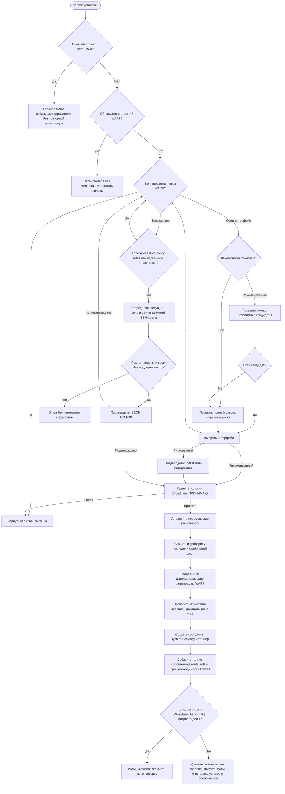
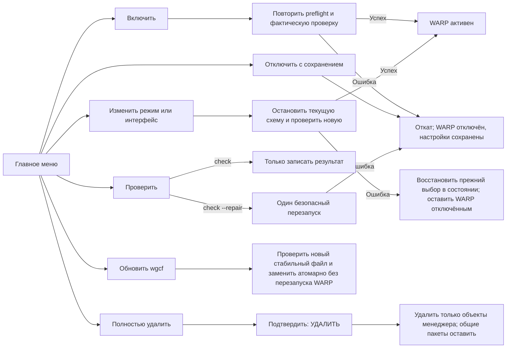

# Менеджер WARP-маршрутизации

Автономный Bash-скрипт для Linux, который устанавливает бесплатный Cloudflare WARP и управляет IPv4-маршрутизацией в одном из двух режимов:

- через WARP проходит трафик, пришедший с одного выбранного интерфейса;
- через WARP проходит исходящий IPv4-трафик самого сервера.

Документация соответствует версии скрипта `1.3.2`.

Скрипт не является частью WDTT Plus, не вызывается Android-приложением и не входит в APK. Он также не настраивает Xray, sing-box, 3x-ui или другие приложения: требуемый входной интерфейс должен существовать заранее.

> [!IMPORTANT]
> По умолчанию показываются только рекомендуемые интерфейсы. Полный список остаётся доступен администратору, но рискованный выбор требует точной фразы `РИСК имя-интерфейса`.

> [!WARNING]
> Режим всего сервера намеренно не включается по умолчанию. Защита SSH уменьшает риск потери доступа, но не гарантирует работу других входящих служб. На важном VPS заранее подготовьте web console или Rescue Mode провайдера.

## Возможности

- русское интерактивное меню с возвратом на предыдущий шаг;
- автоматическая установка недостающих системных инструментов;
- автоматический поиск последнего стабильного `wgcf` для `amd64` и `arm64`;
- отказ от draft, alpha, beta, RC и нестандартных тегов релиза;
- двойная проверка SHA-256 по `checksums.txt` и `digest` GitHub-релиза;
- отдельная таблица policy routing без добавления WARP-default route в `main`;
- обнаружение стороннего WARP, чужих policy rules и firewall-правил;
- безопасное отключение с сохранением регистрации и профиля;
- полное удаление только принадлежащих менеджеру объектов;
- статус, счётчики трафика, handshake, выходной IP и журналы по категориям;
- проверка примерно каждые пять минут (со случайной задержкой до 30 секунд) с одной попыткой восстановления;
- российский формат времени с явной временной зоной сервера.

## Режимы маршрутизации

| Свойство | Один входной интерфейс | Весь сервер |
|---|---|---|
| Что попадает в WARP | Пакеты с `iif` выбранного интерфейса | Исходящий IPv4-трафик хоста |
| Выбор интерфейса | Рекомендуемый или полный список | Не требуется |
| Основной default route | В таблице `main` не изменяется | В таблице `main` не изменяется; общее `ip rule` выбирает WARP-таблицу |
| IPv4 forwarding | Включается и сохраняется через sysctl | Скриптом не меняется |
| Firewall | Маркированные MASQUERADE/FORWARD через iptables | Новые NAT/FORWARD-правила не добавляются |
| Защита SSH | Основной/SSH-интерфейс исключается из рекомендаций | Ответы со всех обнаруженных SSH-портов направляются через `main` |
| IPv6 | Не перенаправляется | Не перенаправляется |

Служебный интерфейс в обоих режимах называется `warp-selective`, а его профиль всегда содержит `Table = off`. Поэтому `wg-quick` сам не заменяет системный default route.

## Схема установки



## Схема управления после установки



## Как выбирается интерфейс

Безопасность не определяется только именами `eth0`, `ens3`, `tun0` или `wg0`. Скрипт читает фактическое состояние ядра, sysfs, маршруты и правила.

Интерфейс не попадает в рекомендуемый список, если он:

- обслуживает текущую SSH-сессию;
- имеет default route в любой IPv4-таблице;
- является активным WireGuard с пиром или прослушиваемым портом;
- уже упомянут в стороннем `ip rule`, iptables или nftables;
- является физическим интерфейсом, bridge, bond или VRF;
- подчинён другому интерфейсу либо имеет подчинённые интерфейсы;
- имеет пользовательские IPv4-маршруты помимо обычного подключённого маршрута ядра;
- является виртуальным интерфейсом неизвестного назначения;
- является `lo`, неактивен или зарезервирован как `warp-selective`.

Без дополнительного подтверждения допускаются распознанные TUN/TAP, `veth` и свободные WireGuard-интерфейсы, если у них нет перечисленных признаков риска.

В режиме «Только рекомендуемые» выводятся лишь доступные кандидаты. Счётчик внизу учитывает только рискованные интерфейсы, которые действительно можно выбрать в полном списке. `lo`, `warp-selective` и неактивные строки без номера в этот счётчик не входят.

В полном списке:

- пронумерованы только доступные для выбора интерфейсы;
- строки без номера показаны справочно и не выбираются;
- рядом с каждым интерфейсом указаны причина оценки и обнаруженные IPv4-маршруты;
- рискованный выбор требует точного ввода `РИСК имя-интерфейса`.

«Рекомендуемый» означает только отсутствие обнаруженных системных признаков риска, а не математическую гарантию совместимости с любой сетевой схемой.

## Если WARP уже установлен

Собственная установка определяется по защищённому файлу состояния и маркеру владельца. Главное меню переключается на управление, а прямая команда `install` отказывается запускать вторую установку и предлагает `reconfigure` или `enable`. Повторный выбор той же конфигурации ничего не перезапускает.

Перед новой установкой проверяются:

- команда `warp-cli`;
- службы `warp-svc.service` и `cloudflare-warp.service`;
- процесс `warp-svc`;
- каталоги официального клиента Cloudflare;
- характерные WireGuard-профили и интерфейсы;
- обычный IPv4-выход через Cloudflare trace;
- policy routing и default routes для режима всего сервера.

При обнаружении стороннего WARP второй туннель не создаётся. Чужие службы, профили, маршруты и firewall-правила не отключаются и не удаляются.

Проверка использует несколько признаков, а не только имя интерфейса. Тем не менее универсально доказать назначение любой произвольной администраторской схемы невозможно: неоднозначность трактуется консервативно, а детали показываются оператору.

## Режим всего исходящего IPv4-трафика

Полный список интерфейсов и режим всего сервера — разные функции. Полный список всё равно выбирает один `iif`; режим всего сервера добавляет общее правило выбора WARP-таблицы.

Перед включением скрипт:

1. запрещает режим при посторонних IPv4 policy rules или default route в отдельной таблице;
2. получает серверный порт текущего SSH-соединения из `SSH_CONNECTION`;
3. читает эффективные порты из `sshd -T`;
4. проверяет активные listeners `sshd` и socket activation systemd;
5. проверяет поддержку `ip rule ... ipproto tcp sport`;
6. требует точную фразу `ВЕСЬ ТРАФИК`;
7. заранее разрешает IPv4-адреса endpoint WARP через `main`;
8. оставляет ответы со всех обнаруженных SSH-портов в `main`;
9. после переключения проверяет маршрут обычного запроса и ответ `warp=on`.

Если набор SSH-портов изменился после настройки, запуск или автопроверка не считают сохранённую защиту актуальной. Выполните `disable`, затем `reconfigure`, чтобы записать новый набор портов.

Защита по исходному TCP-порту предназначена для ответов SSH. Другие входящие IPv4-службы могут потерять корректный обратный маршрут. IPv6 остаётся вне WARP и может раскрывать обычный IPv6-выход, если приложение его использует.

## Требования и изменения системы

Для установки и управления нужны:

- Linux с активным `systemd`;
- архитектура `x86_64`/`amd64` или `aarch64`/`arm64`;
- права root;
- доступ к GitHub и API Cloudflare;
- если каких-либо зависимостей ещё нет — `apt`, `dnf`, `yum`, `zypper`, `apk` или `pacman`.

Если необходимые команды отсутствуют, скрипт автоматически устанавливает WireGuard tools, `curl`, `jq`, сертификаты, iproute2, iptables, util-linux и coreutils. Для `apt` перед установкой выполняется `apt-get update`. Уже установленные пакеты не обновляются специально.

Перед регистрацией нужно явно ввести `ПРИНИМАЮ`, подтверждая условия Cloudflare. Используется сторонний клиент `wgcf`, скачанный из официального GitHub-релиза проекта и проверенный до запуска.

## Первый запуск

Готовый архив `warp-interface-manager-v<VERSION>.tar.gz` можно скачать со
страницы выпуска WDTT Plus. Внутри находятся сам скрипт, эта инструкция и
`SHA256SUMS` для проверки файлов. WARP-менеджер остаётся самостоятельным
проектом и не входит в APK.

```bash
chmod +x warp-interface-manager.sh
sudo ./warp-interface-manager.sh
```

После установки меню доступно как:

```bash
sudo warp-interface-manager
```

Пункт `0` при выборе интерфейса возвращает к выбору области маршрутизации, а на экране выбора области — в главное меню. Отказ от условий также возвращает в меню без начала установки.

`scan` и `self-test` не изменяют систему. Для `scan` всё же рекомендуется `sudo`: без root некоторые серверы не позволяют полностью прочитать firewall, поэтому оценка интерфейсов может быть неполной. Для `self-test` root не нужен.

## Команды

| Команда | Назначение |
|---|---|
| `scan` | Показать рекомендуемые интерфейсы без изменений системы |
| `install` | Запустить интерактивную установку |
| `enable` | Включить сохранённую конфигурацию после повторного preflight |
| `disable` | Отключить WARP и автопроверку, сохранив профиль и регистрацию |
| `reconfigure` | Изменить режим или интерфейс |
| `check` | Проверить маршрут, Cloudflare trace и handshake без перезапуска |
| `check --repair` | При ошибке выполнить один перезапуск; при повторной ошибке отключить WARP |
| `status` | Показать режим, службы, версию `wgcf` и последнюю проверку |
| `stats` | Показать трафик, handshake, endpoint, MTU и выходной WARP-IP |
| `update-wgcf` | Проверить и атомарно заменить `wgcf`, не перезапуская WARP |
| `logs` | Показать события или открыть категории журналов в интерактивном терминале |
| `remove` | Полностью удалить локальные объекты менеджера после слова `УДАЛИТЬ` |
| `self-test` | Проверить обработку профиля и метаданных релиза без изменения системы |
| `--version` | Показать версию менеджера |
| `--help` | Показать встроенную справку |

Пример:

```bash
sudo warp-interface-manager status
sudo warp-interface-manager check
sudo warp-interface-manager check --repair
```

## Как выбирается `wgcf`

Версия `wgcf` не зафиксирована в скрипте. При установке и `update-wgcf` менеджер:

1. запрашивает `https://api.github.com/repos/ViRb3/wgcf/releases/latest`;
2. требует `draft: false` и `prerelease: false`;
3. принимает только тег `vX.Y.Z` или `X.Y.Z`;
4. выбирает ровно один Linux-файл для текущей архитектуры;
5. принимает только ожидаемые GitHub download URL;
6. ограничивает размер метаданных, checksum-файла и бинарника;
7. сравнивает SHA-256 из `checksums.txt`, `digest` GitHub API и скачанного файла;
8. проверяет команды и параметры CLI, необходимые для `register` и `generate`;
9. при наличии регистрации проверяет, что новый файл способен прочитать её и создать профиль;
10. только после этого атомарно заменяет локальный `wgcf`.

Alpha, beta, RC, draft, неоднозначные assets, неподходящий URL, несовпадающий SHA-256 или несовместимый CLI приводят к отказу без замены рабочего файла.

## Проверки и откат

Перед признанием запуска успешным проверяются:

- отсутствие `warp-selective` в таблице `main`;
- маршрут от внутреннего WARP-адреса через `warp-selective`;
- ответ Cloudflare `warp=on` или `warp=plus`;
- ненулевой WireGuard handshake;
- для всего сервера — также маршрут обычного IPv4-запроса через WARP.

При ошибке запуска менеджер удаляет только свои route/rule/firewall-правила, опускает собственный интерфейс и сохраняет состояние `failed`. Установка, регистрация и профиль остаются для просмотра журналов и последующего `enable`.

`disable` удаляет активную маршрутизацию, отключает автозапуск службы и таймера, но сохраняет настройки. `enable` выполняет preflight заново. При неудачной активной реконфигурации прежний выбор записывается обратно, однако WARP остаётся отключённым — это предотвращает цикл перезапусков с потенциально опасной схемой.

Это fail-open, а не kill switch: при отключении или неудачном восстановлении трафик может вернуться к обычному маршруту. Строгую блокировку прямого выхода нужно проектировать отдельно под конкретный сервер.

## Журналы и время

Сырые сообщения установки не выводятся сплошным потоком в меню. Они сохраняются с правами `600`:

```text
/var/log/warp-interface-manager/events.log
/var/log/warp-interface-manager/install.log
```

Системные журналы доступны из меню и напрямую:

```bash
sudo journalctl -u warp-interface-manager.service -n 50 --no-pager
sudo journalctl -u warp-interface-manager-check.service -n 50 --no-pager
```

Меню «Журналы» разделяет события менеджера, подробности установки, службу маршрутизации и автоматические проверки. Старые ISO timestamps преобразуются только при просмотре; файлы истории не переписываются.

Время отображается по часам и временной зоне самого сервера в формате `ДД.ММ.ГГГГ ЧЧ:ММ:СС ЗОНА (+смещение)`, например `03.09.2026 18:29:15 UTC (+00:00)`. Скрипт не меняет системное время или timezone и не переводит его принудительно в Москву. Во внутренних файлах остаются ISO timestamps и Unix epoch, поэтому формат интерфейса не влияет на systemd-таймеры и маршрутизацию.

## Управляемые объекты

Менеджер использует только собственные имена и маркеры:

```text
/usr/local/sbin/warp-interface-manager
/usr/local/lib/warp-interface-manager/
/etc/warp-interface-manager/
/etc/wireguard/warp-selective.conf
/etc/sysctl.d/90-warp-interface-manager.conf
/var/lib/warp-interface-manager/
/var/log/warp-interface-manager/
/run/warp-interface-manager/
/etc/systemd/system/warp-interface-manager.service
/etc/systemd/system/warp-interface-manager-check.service
/etc/systemd/system/warp-interface-manager-check.timer
```

Состояние, регистрация и ключи имеют ограниченные права. Существующие объекты без правильного маркера владельца не перезаписываются. Общие системные пакеты при `remove` не удаляются, поскольку могут использоваться другими приложениями.

Если до выборочной установки IPv4 forwarding был выключен, при полном удалении менеджер выключит его обратно только при отсутствии другого sysctl-конфига, который явно требует `net.ipv4.ip_forward=1`.

> [!NOTE]
> У `wgcf` нет команды удаления созданной записи устройства на стороне Cloudflare. `remove` стирает локальную регистрацию и ключи, но серверная запись Cloudflare может сохраниться.

## Самопроверка проекта

Встроенная проверка не меняет маршрутизацию и не требует root:

```bash
./warp-interface-manager.sh self-test
```

Расширенный тестовый набор использует временные каталоги и команды-моки:

```bash
bash -n warp-interface-manager.sh
bash tests/run-tests.sh
```

Он проверяет фильтрацию интерфейсов, отказ при стороннем WARP, SSH-порты, оба режима policy routing, фактическую модель проверки, откат, очистку при потере runtime-файла, стабильный SemVer-релиз `wgcf`, российский формат времени и навигацию назад.

## Ограничения

- поддерживается только IPv4;
- это не kill switch;
- защита SSH не заменяет web console или Rescue Mode;
- другие входящие службы в режиме всего сервера требуют отдельной проверки;
- скрипт создаёт только собственный `warp-selective`, но не создаёт выбираемый TUN/WireGuard/`veth` интерфейс приложения;
- скрипт не объединяет две чужие VPN/WARP-схемы и не удаляет их правила;
- назначение полностью произвольной сетевой конфигурации невозможно определить со стопроцентной гарантией.

## Изоляция проекта

Каталог `warp-interface-manager/` является отдельным проектом внутри репозитория. Он не подключён к Android-модулям и APK-ресурсам, не импортирует код приложения и не управляет его конфигурацией. Предрелизная задача Gradle лишь создаёт из скрипта и README отдельный проверяемый архив рядом с APK и серверным комплектом.
